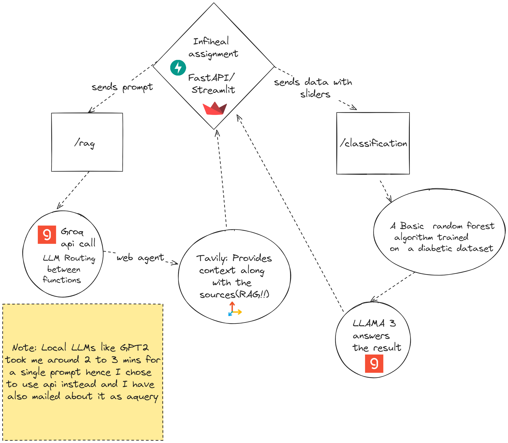

# Mental Health Chatbot and Diabetes Classification API

## Overview

This project consists of a FastAPI server with two main endpoints: `/rag` and `/classification`.

### /rag Endpoint
The `/rag` endpoint is designed to be a Retrieval-Augmented Generation (RAG) application for a mental health chatbot. Users can submit prompts describing their mental health issues, and the chatbot will provide relevant articles or blog posts to assist them. Although it was initially intended to use open-source large language models (LLMs) for this purpose, due to the slow performance of local LLMs like GPT-2, the implementation uses Groq's Llama3-8b-8192 model. Tavily is used for web searches to retrieve relevant content.

### /classification Endpoint
The `/classification` endpoint provides a classification model to classify data into appropriate categories. For this project, a Random Forest model was trained to detect diabetes based on specific health parameters. 

## Hugging Face Space
A demo of the application can be found on Hugging Face Spaces: [InfiHeal Demo](https://huggingface.co/spaces/Ashish1722/infiheal_demo/tree/main).

## Project Structure
- `app.py`: The main FastAPI application.
- `Dockerfile`: Dockerfile for containerizing the FastAPI server.
- `requirements.txt`: List of dependencies for the project.
- `rf_model.sav`, `normalizer.sav`, `scaler.sav`: Pre-trained model, normalizer, and scaler for the classification endpoint.

## Setup Instructions

### Prerequisites
- Python 3.11.5
- Docker (optional, for containerization)

### Installation
1. Clone the repository:
    ```sh
    git clone <repository_url>
    cd <repository_directory>
    ```

2. Install the dependencies:
    ```sh
    pip install -r requirements.txt
    ```

3. Run the FastAPI server:
    ```sh
    uvicorn app:app --reload
    ```
4. Or using devmode once requirements are installed:
    ```sh
    fastapi dev
    ```

### Docker Setup
1. Build the Docker image:
    ```sh
    docker buildx build -t myapp:latest.
    ```

2. Run the Docker container:
    ```sh
    docker run -d -p 8000:8000 myapp:latest
    ```

### Endpoints

#### /rag
- **Method**: POST
- **Description**: Provides relevant articles or blog posts based on user prompts related to mental health issues.
- **Request**:
    ```json
    {
        "prompt": "I am feeling anxious and need help."
    }
    ```
- **Response**:
    ```json
    {
        "response": " Iam here to help here are some solutions and suggestions with  references"
    }
    ```

#### /classification
- **Method**: POST
- **Description**: Classifies data into categories, specifically for diabetes detection.
- **Request**:
    ```json
    {
        "pregnancies": 1,
        "glucose": 110,
        "bp": 72,
        "sknthck": 20,
        "insulin": 79,
        "bmi": 32.0,
        "pdf": 0.5,
        "age": 33
    }
    ```
- **Response**:
    ```json
    {
        "predicted_class": 0,
        "predicted_probability": 92.5
    }
    ```
## Detailed WorkFlow


## Notes
- Local LLMs were taking too long to test, even GPT-2. Therefore, Groq's Llama3-8b-8192 model was used for the RAG mechanism to ensure efficient performance.
- The project is containerized for production using Docker. The Dockerfile and `requirements.txt` file are provided for easy setup and deployment.

## Hugging Face Space
A demonstration of the application can be found on Hugging Face Spaces: [InfiHeal Demo](https://huggingface.co/spaces/Ashish1722/infiheal_demo/tree/main).

## Contact
For any queries or issues, please contact K Eswar Ashish at ashish.171222@gmail.com

